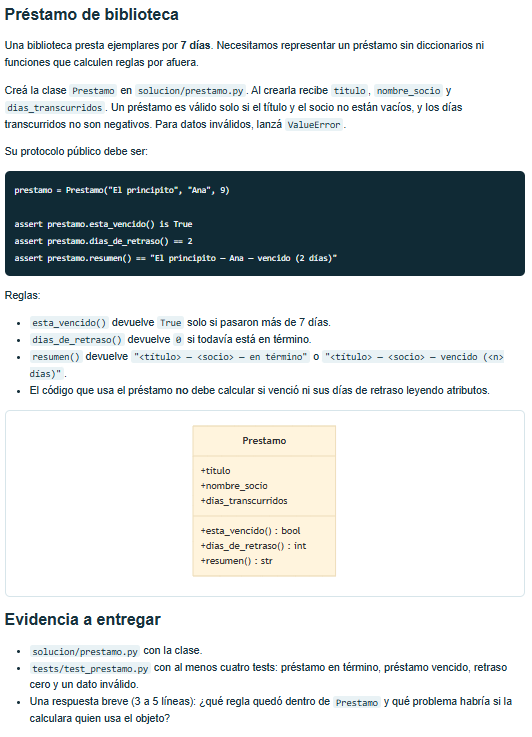

La clase Prestamo tiene las reglas para determinar si un préstamo está vencido y calcular los días de retraso, cualquier
parte del programa usa los mismos criterios con sus métodos.
Si el que usa el objeto hiciera esos cálculos, la lógica se repetiría y podrían aparecer resultados distintos o errores.